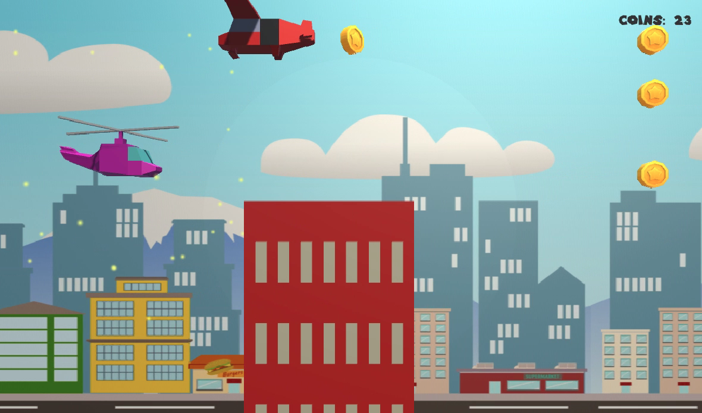
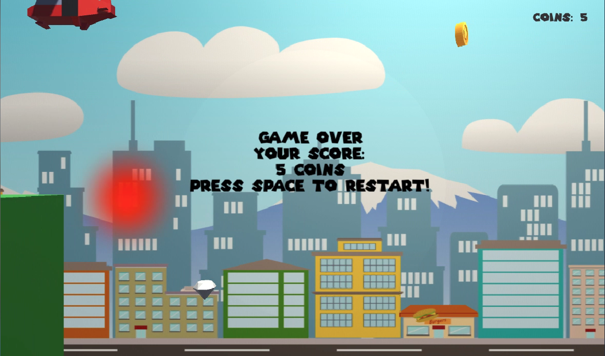

# Helicopter-50

Project 8 of [CS50's Introduction to Games Development](https://cs50.harvard.edu/games/2018/)


*Helicopter-50* is a 3D remake of the Flash classic [Helicopter Game](https://www.addictinggames.com/clicker/helicopter-game) (2004). This exercise served as an introduction to Unity and an opertunity to get comfortable with component based programming.

[Full project specification](https://cs50.harvard.edu/games/2018/projects/8/helicopter/).

## Setup
First, clone this repository:
```bash
git clone https://github.com/calumbell/cs50g-helicopter-50
```

Download the [Unity Hub](https://unity3d.com/get-unity/download/) and install v 2018.4. Locate the *cs50g-helicopter-50* directory in the Unity Hub to open it. Once the project has opened in Unity, press the Play button to test the game.

## Visuals
You can see a video demonstration of this project [here](https://youtu.be/Yf6Pf22AeqE).




## Requirements
*Helicopter-50* was built using the [Unity](https://unity.com/) Game Engine (version 2018.4)